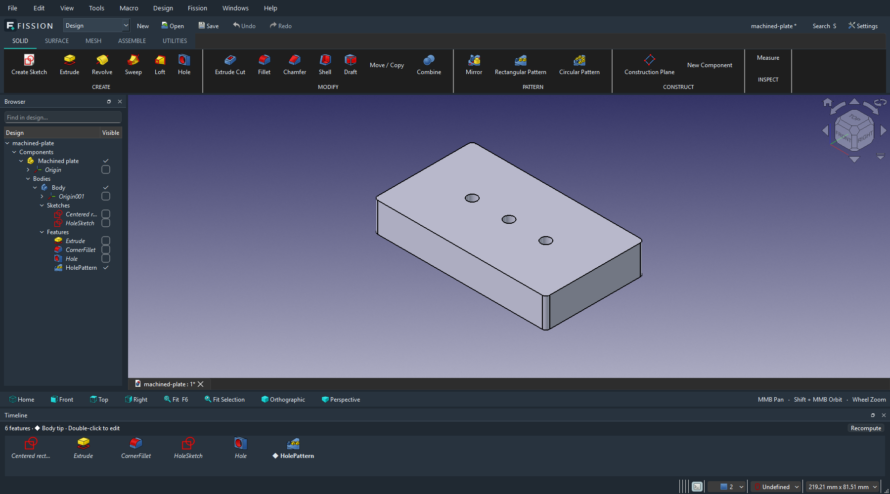

# Fission

Fission 0.1 Alpha is native parametric mechanical CAD, built from pinned FreeCAD source with a unified
Design workspace, product Browser, horizontal feature Timeline, and
Fusion-familiar keyboard and mouse controls. Original Fission branding; the
FreeCAD document model, constraint solver and geometry engine remain authoritative.



## Run on Windows

For this development checkout:

```powershell
.\Launch-Fission.ps1
```

The native application is `build/windows-release/bin/Fission.exe`. For the
portable package, extract the complete `Fission-Alpha-Windows-x64.zip` and open
`Fission/bin/Fission.exe`. Keep its companion folders together.

Choose **New**, then **Create Sketch** and a plane. Sketch tools appear in the
contextual toolbar. **Finish Sketch** returns to solids; **E** also finishes a
sketch and opens Extrude. Select a solid edge and press **F** for Fillet. **H**
opens Hole, **M** Move / Copy, **I** Measure, and **S** command search. Drag the
middle mouse button to pan; hold Shift while dragging it to orbit. F6 fits the
design. Double-click a Timeline feature to edit its native parameters.
The portable package includes an editable `examples/machined-plate.FCStd` design.

## Build and verify

```powershell
.\build.ps1 -Jobs 12 -Test
.\scripts\test-gui.ps1
.\scripts\package.ps1
```

Builds require Visual Studio C++ Build Tools and a Windows SDK. Setup downloads
and verifies the official FreeCAD LibPack and recursive pinned engine source.
The runtime has its own Fission preferences and does not require a FreeCAD install.

See [build instructions](FISSION_BUILD.md), [shortcut mappings](FISSION_SHORTCUTS.md),
[architecture](FISSION_ARCHITECTURE.md), and [status and limitations](FISSION_STATUS.md).
This development release retains native feature panels and CAD semantics;
specialist Drawing/CAM workflows and several Fusion commands remain partial.

Fission is based on the FreeCAD open-source project. Source and dependency
copyrights/licenses are preserved in [NOTICE.md](NOTICE.md), the matching source
archive and bundled licenses. Fission is an independent project.
